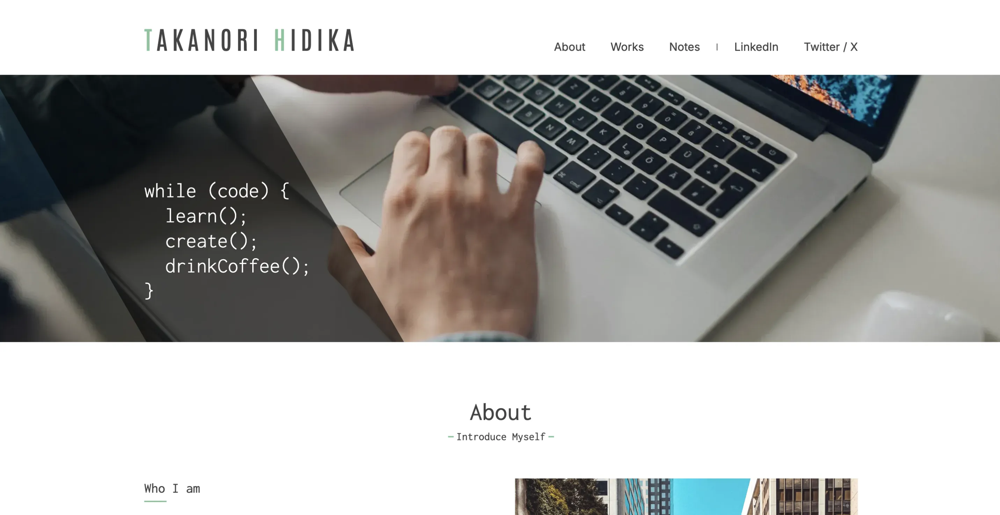
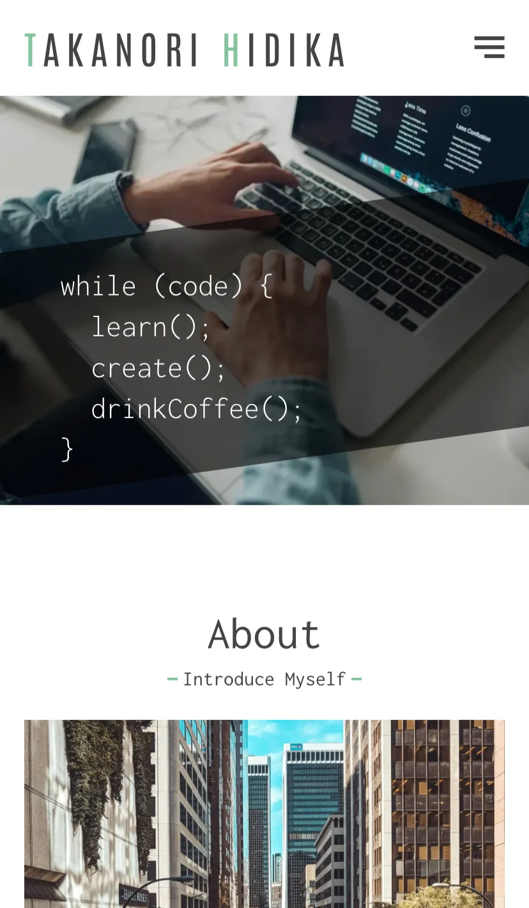

# My Personal Site

<div align="center">
  
  
  <br><br>
  <a href="https://takanorihidaka.com/" target="_blank">
    
  </a>
  <br><br>
  <p>
    <a href="#overview">Overview</a> •
    <a href="#what-i-learned">What I Learned</a> •
    <a href="#tech-stack">Tech Stack</a> •
    <a href="#installation">Installation</a> •
    <a href="#license">License</a>
  </p>
</div>
<br>

## Overview

This is the second iteration of my personal portfolio site.

After completing version 1, I spent several months building other Next.js projects and experimenting with a simple full-stack setup using Node.js and Express. Through these experiences, my understanding of Next.js deepened.

In version 1, I managed URL-based state using `router.push` and `useState`, and relied on API Routes for data fetching. This approach was influenced by the tutorial I followed at the time. However, as I continued studying and building projects, I realized that the patterns I had used were not always aligned with the framework’s intended approach.

By leveraging Server Components and utility functions directly, most data fetching can be handled without API Routes. User interactions can be handled with Server Actions where appropriate. API Routes are still useful, but mainly when exposing logic to external services or other clients.

Version 2 is a reconstruction of the same site — with nearly identical UI — but with a simplified and more framework-aligned architecture. The goal was not to redesign the interface, but to refine the internal structure and reflect what I learned through continued study and experimentation.

For the initial implementation and a detailed summary of what I learned in version 1, see the v1 repository:  
https://github.com/hidaka88jp/portfolio--personal-site

<br>

## What I Learned

- Reused existing types with `Pick` to avoid duplicated type definitions and prevent mismatches between API response types and UI prop types.
- Simplified URL-driven state management by relying on `Link` instead of `router.push` and `useState`, enabling Server Component rendering.
- Refactored data transformation logic to run once before rendering, rather than executing lookups inside every `map` iteration.
- Reconsidered rendering strategy and switched from ISR to SSR based on realistic traffic expectations.
- Enhanced metadata with Open Graph tags.
- Added sitemap and robots configuration to align with common web and SEO practices.
- Refined testing strategy by focusing on meaningful logic tests instead of superficial UI assertions.
- Separated logic from UI components to enable cleaner unit testing.

<br>

## Tech Stack

<table>
  <tr>
    <th>Frontend</th>
    <td>
      
      
      
      
    </td>
  </tr>
  <tr>
    <th>Backend</th>
    <td>
      
    </td>
  </tr>
  <tr>
    <th>Code Quality</th>
    <td>
      
      
      
    </td>
  </tr>
  <tr>
    <th>Testing</th>
    <td>
      
    </td>
  </tr>
  <tr>
    <th>Deployment</th>
    <td>
      
    </td>
  </tr>
</table>

### Notes on Tooling
- This project does not use GitHub Actions. Deployment is handled by connecting the GitHub repository directly to Vercel.
- Type checking and tests run on `pre-push` hooks using Husky.
- ESLint and Prettier are intentionally decoupled to keep formatting and static analysis responsibilities separate.
  - On save (VS Code), only Prettier runs.
  - On commit, both Prettier and ESLint are executed via Husky.

<br>

## Installation

To run this project locally, clone the repository and install the dependencies:
```bash
git clone https://github.com/hidaka88jp/portfolio--personal-site-v2
cd portfolio--personal-site-v2
npm install
```

This project uses microCMS as a headless CMS.
You will need to create your own microCMS service and obtain the required API keys.

Create a .env file in the root directory and add the following environment variables:
```
MICROCMS_SERVICE_DOMAIN=your_service_domain
MICROCMS_API_KEY=your_api_key
```
Then start the development server:
```bash
npm run dev
```

## License

This project was created for educational and portfolio use.  
Licensed under the [MIT License](./LICENSE). 